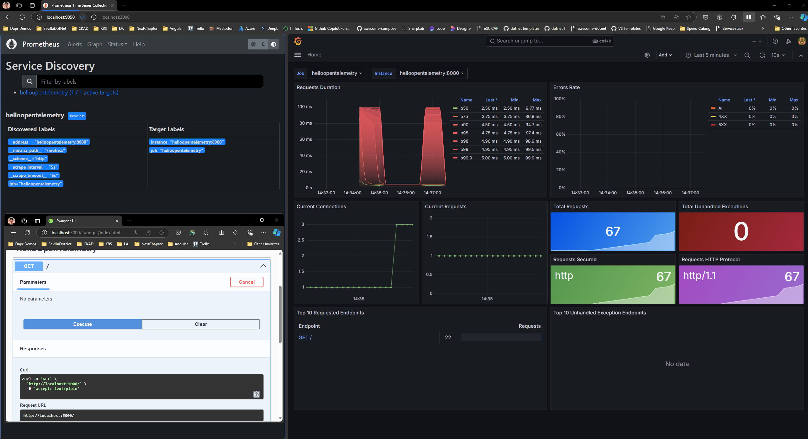

# Hellow Open Telemetry

This is an example project to demonstrate and follow step-by-step telemetry in a .NET application using OpenTelemetry. The project includes services for Prometheus, Grafana, and Jaeger to monitor and visualize telemetry data.



## Requirements

- Docker
- Docker Compose

## Project Structure

- `src/`: Contains the source code of the .NET application.
- `deploy/`: Contains configuration files for Prometheus and Grafana.
  - `prometheus/`: Prometheus configuration files.
  - `grafana/config/`: Grafana configuration files.
  - `grafana/dashboards/`: Grafana dashboards.

## Services

The project uses the following services defined in the `docker-compose.yml` file:

- **helloopentelemetry**: The main .NET application.

  - **Ports**: `5000:8080`
  - **Environment Variables**:
    - `ASPNETCORE_ENVIRONMENT=Development`
    - `OTEL_EXPORTER_OTLP_ENDPOINT=http://jaeger:4317`
    - `OTEL_SERVICE_NAME=helloopentelemetry`
  - **Depends on**: `prometheus`

- **prometheus**: Prometheus service for scraping and storing metrics.

  - **Image**: `prom/prometheus:latest`
  - **Ports**: `9090:9090`
  - **Volumes**: `./deploy/prometheus/:/etc/prometheus/`

- **grafana**: Grafana service for visualizing metrics.

  - **Image**: `grafana/grafana-oss:latest`
  - **Ports**: `3000:3000`
  - **Volumes**:
    - `./deploy/grafana/config/:/etc/grafana/`
    - `./deploy/grafana/dashboards/:/var/lib/grafana/dashboards/`
  - **Depends on**: `prometheus`

- **jaeger**: Jaeger service for tracing.
  - **Image**: `jaegertracing/all-in-one:latest`
  - **Ports**: `16686:16686`, `14268:14268`, `14250:14250`, `6831:6831/udp`, `6832:6832/udp`, `5778:5778`

## Installation

1. Clone the repository:

   ```sh
   git clone https://github.com/your-username/your-repository.git
   cd your-repository
   ```

2. Build and start the containers using Docker Compose:
   ```sh
   docker-compose up --build
   ```

## Usage

Access the application and services in your web browser:

- **helloopentelemetry**: `http://localhost:5000`
- **Prometheus**: `http://localhost:9090`
- **Grafana**: `http://localhost:3000`
- **Jaeger**: `http://localhost:16686`

## Useful Commands

- To stop the containers:

  ```sh
  docker-compose down
  ```

- To rebuild the containers without using the cache:

  ```sh
  docker-compose build --no-cache
  ```

- To view the logs of the containers:
  ```sh
  docker-compose logs
  ```

## Contributing

1. Fork the project.
2. Create a new branch (`git checkout -b feature/new-feature`).
3. Make your changes and commit them (`git commit -am 'Add new feature'`).
4. Push your changes (`git push origin feature/new-feature`).
5. Open a Pull Request.

## License

This project is licensed under the MIT License - see the [LICENSE](LICENSE) file for details.
